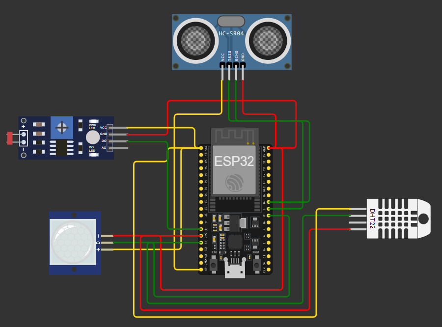

# Sistema de Monitoramento de Agro com ESP32

## Visão Geral
Este projeto é um sistema de monitoramento de agro desenvolvido utilizando o microcontrolador ESP32 e diversos sensores. O sistema é capaz de monitorar a invasão, o nível de água, o clima e a luminosidade, ativando ou desativando a irrigação conforme necessário. Este projeto foi desenvolvido como parte do curso de Inteligência Artificial da FIAP.

## Funcionalidades
- **Monitoramento de Temperatura e Umidade**: Utiliza o sensor DHT22 para medir a temperatura e a umidade do ambiente.
- **Monitoramento do Nível de Água**: Utiliza o sensor ultrassônico HC-SR04 para medir a distância do nível de água.
- **Monitoramento de Luminosidade**: Utiliza um sensor LDR para medir a intensidade da luz.
- **Detecção de Movimento**: Utiliza um sensor PIR para detectar movimento e possíveis invasões.
- **Controle de Irrigação**: Ativa ou desativa a irrigação com base nos dados coletados pelos sensores.

## Componentes Utilizados
- **ESP32**: Microcontrolador principal do projeto.
- **DHT22**: Sensor de temperatura e umidade.
- **HC-SR04**: Sensor ultrassônico para medir o nível de água.
- **LDR**: Sensor de luminosidade.
- **PIR**: Sensor de movimento.

## Estrutura do Projeto
O projeto está organizado da seguinte forma:
- **src/**: Contém o código fonte do projeto.
- **docs/**: Contém a documentação do projeto, incluindo o README detalhado.
- **app/**: Contém o código principal do projeto e o seu JSON.
- **test/**: Contém testes manuais do projeto.

## Diagrama do projeto

## Como Executar o Projeto
### No Wokwi
1. Acesse [Wokwi](https://wokwi.com).
2. Importe o projeto utilizando o link: [https://wokwi.com/projects/413004137805432833](https://wokwi.com/projects/413004137805432833).
3. Clique em "Simulate" para iniciar a simulação.

## Instalação e Dependências
1. Instale a [Arduino IDE](https://www.arduino.cc/en/software).
2. Adicione a placa ESP32 na Arduino IDE através do gerenciador de placas.
3. Instale as seguintes bibliotecas através do gerenciador de bibliotecas da Arduino IDE:
   - DHT sensor library
   - Ultrasonic

## Contribuição
Contribuições são bem-vindas! Sinta-se à vontade para abrir issues e pull requests para melhorias e correções.
