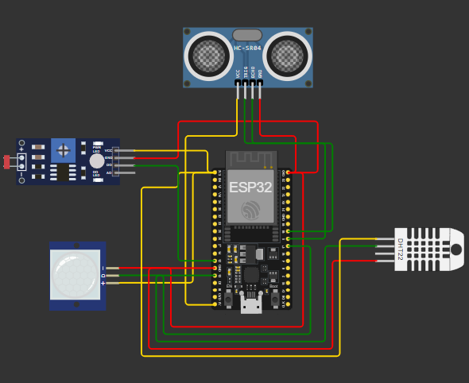

# Projeto de Monitoramento de Agro com ESP32

## Objetivo do Projeto
Este projeto foi desenvolvido como parte do curso de Inteligência Artificial da FIAP. O objetivo é simular um sistema de monitoramento de agro utilizando o microcontrolador ESP32 e diversos sensores. O sistema monitora a invasão, o nível de água, o clima e a luminosidade, ativando ou desativando a irrigação conforme necessário.

## Desenho do Circuito
O circuito é composto pelos seguintes sensores:
- **DHT22**: Sensor de temperatura e umidade
- **HC-SR04**: Sensor ultrassônico para medir o nível de água
- **LDR**: Sensor de luminosidade
- **PIR**: Sensor de movimento

### Diagrama de Conexões
![Diagrama do Circuito]

## Descrição dos Sensores
- **DHT22**: Mede a temperatura e a umidade do ambiente. Se a umidade estiver abaixo do ideal ou a temperatura estiver acima do ideal, a irrigação é ativada.
- **HC-SR04**: Mede a distância do nível de água. Se o nível de água estiver abaixo do necessário, a irrigação é desativada.
- **LDR**: Mede a intensidade da luz. Se a luminosidade estiver abaixo do ideal, a irrigação é ativada.
- **PIR**: Detecta movimento. Se uma invasão for detectada, uma mensagem de alerta é enviada.

## Configuração e Execução no Wokwi e ESP32
### No Wokwi
1. Acesse [Wokwi](https://wokwi.com).
2. Importe o projeto utilizando o link: [https://wokwi.com/projects/413004137805432833](https://wokwi.com/projects/413004137805432833).
3. Clique em "Simulate" para iniciar a simulação.

### No ESP32
1. Conecte o ESP32 ao seu computador.
2. Abra o Arduino IDE.
3. Selecione a placa ESP32 e a porta correta.
4. Carregue o código `sketch.ino` para o ESP32.

## Instruções de Instalação e Dependências
1. Instale a [Arduino IDE](https://www.arduino.cc/en/software).
2. Adicione a placa ESP32 na Arduino IDE através do gerenciador de placas.
3. Instale as seguintes bibliotecas através do gerenciador de bibliotecas da Arduino IDE:
   - DHT sensor library
   - Ultrasonic

## Testes Realizados
### Monitor Serial
Durante a execução do projeto, as seguintes mensagens podem ser observadas no Monitor Serial:

- **Inicialização**:
Sistema de monitoramento iniciado.

- **Detecção de Invasão**:
Invasão detectada! Ativando alarmes de segurança... Nenhuma invasão detectada.

- **Checagem do Nível de Água**:
A distância de líquidos nos reservatórios de água: [distância]

- **Checagem do Clima**:
Temperatura: [temperatura] Umidade: [umidade] A umidade ou a temperatura não está ideal!

- **Luminosidade Recebida**:
A luminosidade está baixa, a irrigação irá ser ativa...

## Conclusão
Este projeto demonstra como utilizar o ESP32 e diversos sensores para monitorar e controlar um sistema de irrigação em uma aplicação de agro. A simulação no Wokwi permite testar e validar o funcionamento do sistema antes de implementá-lo no hardware real.