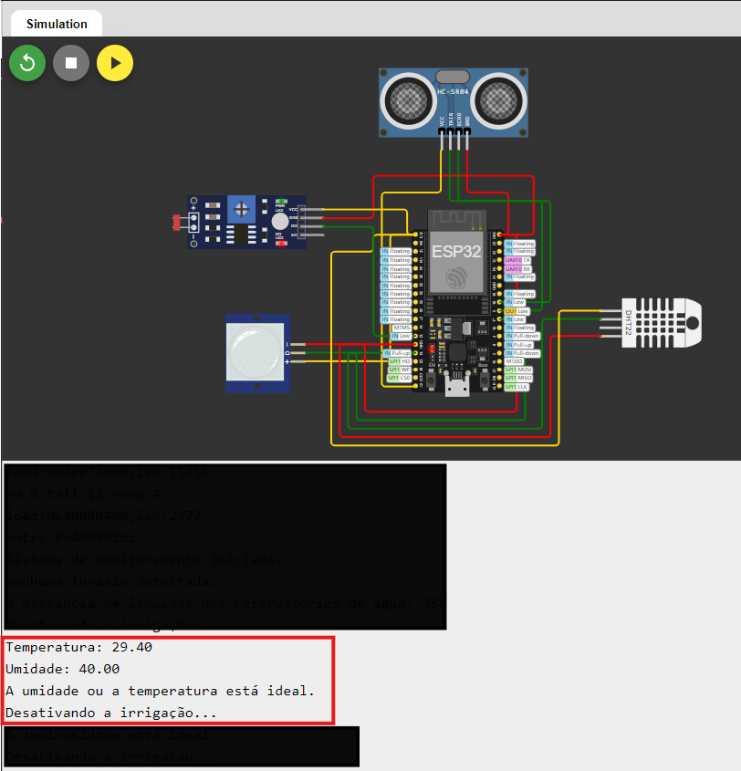
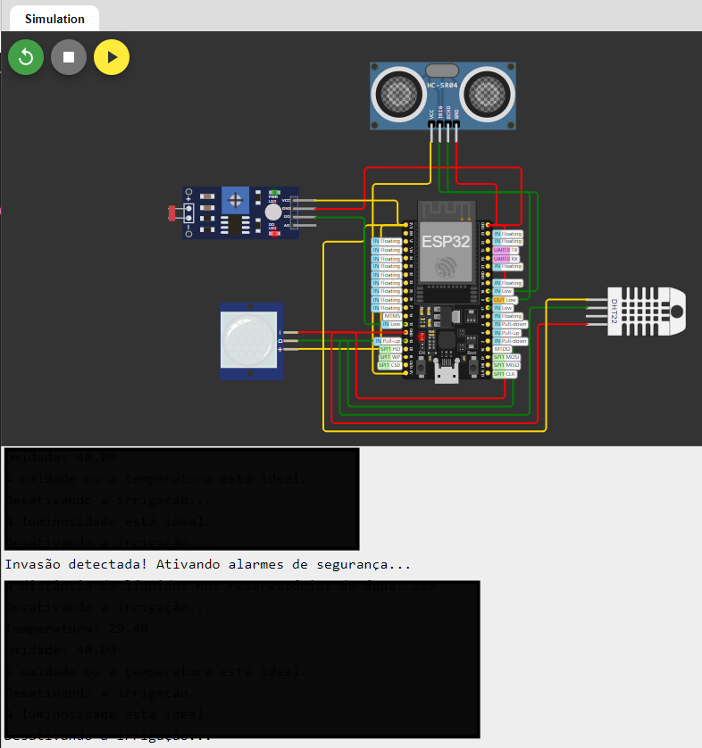
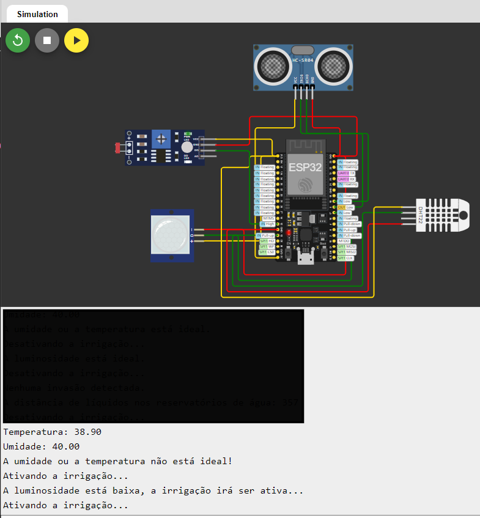

# ESP32 Sensores Agro - Testes Manuais

## Descrição do Projeto

Este projeto utiliza o ESP32 para monitoramento de sensores agrícolas. O objetivo é coletar dados ambientais e de solo para otimizar o cultivo.

## Estrutura do Projeto

- **src/**: Código fonte do projeto.
- **tests/**: Scripts e documentação de testes.
  - **TESTES.md**: Documentação dos testes manuais.

## Testes Manuais

### Teste 1: Temperatura e umidade ideal

**Objetivo**: Checar a temperatura e a umidade está ideal ou não para a irrigação ser ativa.

**Passos**:
1. Ligar o ESP32.
2. Confirmar o DHT22 e ajustar a temperatura e umidade para o nível ideal de acordo com as variáveis definidas.

**Resultado Esperado**: Se a temperatura e a umidade estiver ideal, ele chama a função de desativar a irrigação.

### Teste 2: Verificar o sensor de presença

**Objetivo**: Verificar o sensor de presença do projeto.

**Passos**:
1. Ligar o ESP32.
2. Clicar no sensor PIR.
3. Clicar no botão "Simulate motion".

**Resultado Esperado**: O ESP32 deve exibir o alerta para uma invasão detectada.

### Teste 3: Abaixando o nível de luminosidade e aumentando o nível da temperatura.

**Objetivo**: Verificar se o sistema irá ser ativo com a luminosidade e a temperatura baixa.

**Passos**:
1. Iniciar o ESP32.
2. Alterar a temperatura do DHT22 e alterar luminosidade do LDR.
3. Verificar se a irrigação foi ativa para ambos.

**Resultado Esperado**: Validar a temperatura e a luminosidade e ativar a irrigação.

